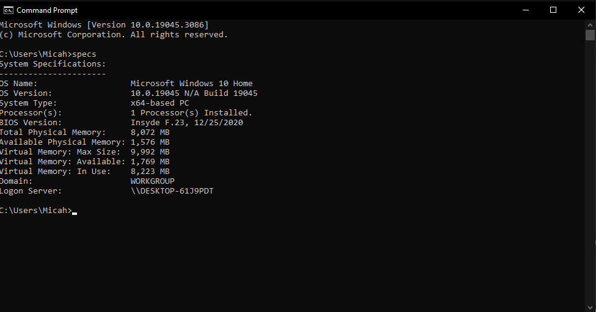

 This work is licensed under a <a rel="license" href="http://creativecommons.org/licenses/by/4.0/">Creative Commons Attribution 4.0 International License</a>.

# specs
A quick tool to retrieve system information from your terminal. Written by AI

# Installation

just run install.bat with admin priviledges and make sure that specs.bat

# Manual Installion

Just copy specs.bat into System32

# OoOoOh aDmIn pRiveDgES, sYsTem32 i DoNt tRuSt.

Its safe. You can check the files to be sure

# shout out to ai

i didnt even write this 💀💀
